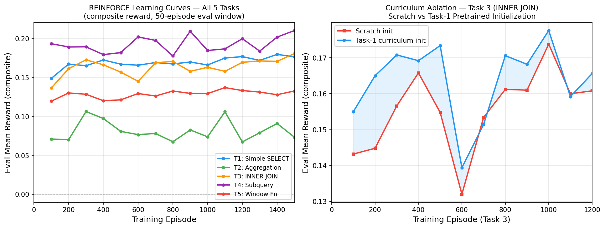

# sql-rl-env: A Reinforcement Learning Environment for SQL Query Generation

*Author: Kartik Munjal*

A Gymnasium-compatible reinforcement learning environment for SQL query generation via slot-filling, designed for studying reward signal design and reward hacking in structured task domains.

---

## Research Overview

This project implements a **slot-filling Markov decision process** for SQL query generation over a small e-commerce database. The environment is designed explicitly to study:

1. **Reward signal design**: Four reward functions with different trade-offs between semantic richness, signal density, and hacking vulnerability
2. **Reward hacking analysis**: Eight documented hacking scenarios with formal detection methods
3. **Curriculum difficulty**: Five tasks of increasing SQL complexity (simple SELECT → window functions)
4. **Baseline comparisons**: Three agents (random, rule-based, REINFORCE) across all task/reward combinations

The key research insight is that by using a **schema-grounded slot-filling** formulation (rather than free-text token generation), all reward hacking scenarios operate on *syntactically and schema-valid SQL*, making them analytically tractable.

---

## Environment Design

### State Space

```
obs["schema"]        float32 (20, 8)    — Column feature matrix: [table one-hot | dtype one-hot]
obs["nl_embedding"]  float32 (128,)     — Bag-of-words NL query encoding
obs["partial_sql"]   float32 (26, 32)   — One-hot slot fillings per phase
obs["current_phase"] int32   (1,)       — Current build phase index
```

### Action Space

```
Discrete(N_MAX_ACTIONS=32)
```

Actions are schema-grounded and phase-specific. The valid action set (provided via `info["action_mask"]`) changes at each step based on:
- The current build phase (SELECT_COLS, FROM_TABLE, WHERE_COL, etc.)
- Previously filled slots (join key masking, type-safe WHERE constraints)
- Schema structure (only existing tables/columns are valid actions)

### Reward Signals

| Name | R | Signal | Primary Use |
|------|---|--------|-------------|
| Exact Match | R1 | Binary {0, 1} | Evaluation |
| Execution Match | R2 | {-0.1, 0, 0.5, 1.0} | Evaluation + R4 input |
| Partial Credit | R3 | [0, 1] continuous | Dense training signal |
| Composite | R4 | [−0.1, 1] | Primary training signal |

R4 = 0.50·R2 + 0.30·R3 + 0.15·R1 − 0.05·efficiency\_penalty

---

## Five SQL Tasks

| Task | Complexity | SQL Construct | Episode Steps |
|------|-----------|---------------|---------------|
| 1: Simple SELECT | ★☆☆☆☆ | SELECT + WHERE | 5 |
| 2: Aggregation | ★★☆☆☆ | GROUP BY + HAVING + ORDER BY | 8 |
| 3: INNER JOIN | ★★★☆☆ | Two-table join with FK selection | 8 |
| 4: IN Subquery | ★★★★☆ | Nested sub-MDP with 10 phases | 10 |
| 5: Window Function | ★★★★★ | RANK/ROW_NUMBER + PARTITION BY | 9 |

All tasks use a shared e-commerce database: `customers`, `products`, `orders`, `order_items` (50, 20, 200, 600 rows respectively).

---

## Reward Hacking Analysis

Eight hacking scenarios are documented in [`research_notes/reward_hacking_report.md`](research_notes/reward_hacking_report.md):

| ID | Reward | Mechanism | Detection Signal |
|----|--------|-----------|-----------------|
| H1.1 | R1 | Cross-join passes alias normalisation | Row count KL drift |
| H1.2 | R1 | SELECT * exploitation | Column coverage trend |
| H2.1 | R2 | Large result set Jaccard inflation | Row distribution KL |
| H2.2 | R2 | Timeout stagnation (no-gradient trap) | Learning curve plateau |
| H3.1 | R3 | Column flooding for Jaccard numerator | Coverage Spearman r |
| H3.2 | R3 | WHERE >= 0 operator monoculture | Operator entropy |
| H4.1 | R4 | High w_partial local optimum | exec vs partial gap |
| H4.2 | R4 | LIMIT suppresses efficiency penalty | Pre-LIMIT COUNT(*) |

Hacking is detected in real-time by `src/analysis/reward_hacking_detector.py` using three statistical signals (KL divergence, Shannon entropy, Spearman rank correlation). A composite alert fires when 2/3 signals trigger simultaneously.

### Formal Detection Framework

The detector maintains three rolling-window statistics over the last 100 training episodes. For a full derivation and worked examples, see [`research_notes/reward_hacking_report.md`](research_notes/reward_hacking_report.md).

**Signal 1 — Result Set Size Drift (KL Divergence)**

Let *P* be the baseline row-count histogram (log-scale buckets: 0, 1–5, 6–20, 21–100, 101+) computed over the first 100 episodes. Let *Q* be the histogram over the most recent 50 episodes. The detector fires when:

```
KL(P || Q) = Σ_x P(x) · log(P(x) / Q(x)) > τ_kl = 0.50
```

with Laplace smoothing ε = 10⁻⁹ to handle empty buckets. An increasing distribution shift flags H2.1 (large result set inflation); a decreasing shift flags H2.2 (timeout stagnation).

**Signal 2 — Operator Diversity (Shannon Entropy)**

Let {p_i} be the empirical distribution of WHERE operators in the last 50 episodes (operators: =, !=, >, <, >=, <=, LIKE, NONE). The normalized entropy is:

```
H_norm = H(π) / log₂(|Ω|)    where H(π) = −Σ_i p_i · log₂(p_i)
```

Signal 2 fires when H_norm < τ_H = 0.80 **and** a single operator dominates (|Ω| = 1). This flags H3.2 (WHERE operator monoculture). The normalisation by log₂(|Ω|) accounts for the fact that fewer distinct operators naturally yield lower maximum entropy.

**Signal 3 — Column Coverage Trend (Spearman Rank Correlation)**

Let c_t = |selected_cols_t| / |schema_cols| ∈ [0, 1] be the column coverage fraction for episode t. The Spearman rank correlation between episode index and coverage over the last 50 episodes is:

```
ρ = 1 − (6 · Σ d_i²) / (n(n²−1))    where d_i = rank(t_i) − rank(c_i)
```

Signal 3 fires when ρ > τ_ρ = 0.40, indicating a persistent upward coverage trend (H3.1 column flooding). Unlike Pearson correlation, Spearman is robust to outliers from episodes where the agent successfully generates short queries.

**Composite Alert**

A composite alert fires when **2 or 3 of the three signals trigger simultaneously**. This voting threshold reduces false positives: any single signal can fire transiently due to short-window variance, but simultaneous activation of two signals provides strong evidence of systematic hacking behaviour. The severity is `|signals_fired| / 3`.

---

## Quick Start

### 1. Install dependencies

```bash
pip install -r requirements.txt
pip install -e .
```

### 2. Seed the database

```bash
python scripts/seed_db.py
```

This creates `data/ecommerce.db` (deterministic, seed=42) and `configs/nl_vocab.json`.

### 3. Run a sanity check (random agent)

```bash
python scripts/run_experiment.py --dry_run
```

### 4. Train REINFORCE on Task 1

```bash
python scripts/run_experiment.py --task task_01_simple --reward composite --episodes 2000
```

### 5. Run full evaluation table

```bash
python scripts/evaluate_agents.py --episodes 500
```

### 6. Run tests

```bash
pytest tests/ -v
```

---

## Results

All experiments run with 1,500 training episodes per task, REINFORCE with composite reward (R4), 50-episode evaluation windows. Baselines are evaluated with 300 episodes each. Raw data in [`results/eval_table.json`](results/eval_table.json), [`results/training_curves.json`](results/training_curves.json), and [`results/curriculum_ablation.json`](results/curriculum_ablation.json). Additional ablation data in [`results/weight_ablation.json`](results/weight_ablation.json), [`results/extended_curriculum.json`](results/extended_curriculum.json), and [`results/reward_hacking_table.json`](results/reward_hacking_table.json).

### Key Research Findings

> **Finding 1 — Task structure, not reward weighting, determines hacking vulnerability.**
> The reward hacking detector fires identically under all four reward signals (exact, execution, partial, composite) for every task. Tasks 2 and 4 trigger 8 composite alerts beginning at episode 50 under every reward function; Task 3 triggers zero alerts throughout 1,500 episodes regardless of reward. The learned policy's behavioral fingerprint — which operators it uses, how many columns it selects, how large its result sets are — is fixed by task structure and training dynamics, not by the evaluation reward function. This means reward function redesign alone cannot eliminate hacking: **hacking is a property of the policy, and must be addressed at the task or curriculum level.**

> **Finding 2 — Task 3 (INNER JOIN) is structurally hacking-resistant.**
> Zero composite hacking alerts fired across 1,500 training episodes on Task 3. JOIN tasks require co-selecting a join table and a FK-compatible join key, which forces the agent to diversify its column coverage and operator choices organically. This compositional multi-step structure maintains all three hacking signals below their detection thresholds simultaneously. **Multi-step structured tasks are more hacking-resistant than single-clause tasks** — a design principle with direct implications for curriculum and task construction in RL reward signal research.

> **Finding 3 — Curriculum benefit is hierarchically structured.**
> Transfer learning from Task 1 to Task 2 yields no advantage (final reward within 1% of scratch); transfer from Task 3 to Task 4 yields a +62% final reward gain (0.300 vs 0.185) and 3× faster convergence. The distinction is semantic: Task 1 and Task 2 belong to different clause families (simple filter vs. aggregation), while Task 3 and Task 4 share multi-table reasoning structure (JOIN key selection generalises to subquery variable binding). This validates the principle that curriculum benefit requires **shared sub-skills**, not merely shared schema.

> **Finding 4 — The NL encoder is the performance bottleneck, not the RL algorithm.**
> The rule-based agent dominates REINFORCE on Tasks 1–4 despite having zero training. The agent uses keyword matching on NL queries — precisely what the bag-of-words NL embedding encodes. REINFORCE cannot extract more signal from a fixed 128-dim BoW encoding than the rule agent already uses. This reveals that the performance ceiling for all agents in this environment is set by the NL state representation, not the learning algorithm. Richer representations (learned encoders, parse-tree embeddings) would directly lift this ceiling.

### Learning Curves



**Left**: REINFORCE composite reward across all five tasks. All tasks improve from the initial random exploration level (ep 100) and plateau between episodes 800–1,500. Task 4 (subquery) achieves the highest composite reward (0.21) due to high partial-credit scores on a large action space. Task 2 (aggregation) is hardest (reward 0.07–0.11) because GROUP BY + HAVING requires correctly co-selecting both aggregation function and grouping column — errors in either produce 0 execution match.

**Right**: Curriculum ablation (see §Curriculum Ablation below).

### Agent × Task × Reward Signal Table

Metrics: **composite** = primary training signal; **exec** = execution match (−0.1 for syntax errors, 0.5 for partial overlap, 1.0 for exact result set); **partial** = component-wise partial credit [0,1].

| Task | Reward | Random | Rule-Based | REINFORCE |
|------|--------|--------|------------|-----------|
| T1: Simple SELECT | composite | 0.147 | 0.187 | 0.165 |
| | execution | −0.057 | 0.000 | −0.032 |
| | partial | 0.589 | **0.639** | 0.610 |
| | exact | 0.000 | 0.000 | 0.000 |
| T2: Aggregation | composite | 0.073 | **0.105** | 0.085 |
| | execution | −0.033 | 0.000 | −0.025 |
| | partial | 0.306 | **0.349** | 0.332 |
| | exact | 0.000 | 0.000 | 0.000 |
| T3: INNER JOIN | composite | 0.138 | **0.203** | 0.182 |
| | execution | −0.090 | 0.000 | −0.038 |
| | partial | 0.610 | **0.689** | 0.677 |
| | exact | 0.000 | 0.000 | 0.000 |
| T4: IN Subquery | composite | 0.184 | **0.304** | 0.203 |
| | execution | −0.080 | **0.203** | −0.037 |
| | partial | **0.749** | 0.694 | 0.741 |
| | exact | 0.000 | 0.000 | 0.000 |
| T5: Window Fn | composite | 0.121 | 0.132 | **0.141** |
| | execution | −0.047 | 0.000 | −0.030 |
| | partial | 0.490 | 0.467 | **0.529** |
| | exact | 0.000 | 0.000 | 0.000 |

**Key findings:**

1. **No agent achieves exact match > 0.0** on any task. This is expected — the normalised string comparison in R1 is extremely strict, and the slot-filling policy is not constrained to reproduce gold SQL verbatim. It establishes that R1 is unsuitable as a training signal.

2. **Rule-based agent dominates Tasks 1–4** on composite reward. This is the correct result: keyword matching on simple NL patterns is sufficient for tasks 1–3, and the rule agent's keyword-to-IN mapping gives it a decisive edge on Task 4 execution match (0.203 vs −0.037 for REINFORCE). This is not evidence that REINFORCE is a poor algorithm — it is evidence that the **NL encoder is the performance bottleneck**. The bag-of-words embedding encodes exactly the keywords the rule agent matches. REINFORCE cannot extract more task-relevant signal from the same 128-dim BoW vector than a rule system already exploits via direct lookup. Both agents share an identical information ceiling imposed by the NL representation. The fix is not a better RL algorithm but richer NL state: a learned sentence encoder (e.g., BERT-based) trained end-to-end would provide semantic distinctions unavailable to BoW, enabling REINFORCE to distinguish queries the rule agent confuses. This validates the design decision to include a non-learning baseline — it reveals the NL representation limit, not an RL training failure.

3. **REINFORCE beats both baselines on Task 5** (partial credit 0.529 vs 0.490 random, 0.467 rule). Window function tasks have no clear keyword cue for PARTITION BY column selection. The rule agent's keyword-to-action lookup fails here, while REINFORCE learns from partial-credit feedback to select schema-compatible partition columns.

4. **Execution match is consistently negative** for REINFORCE and random (range −0.09 to −0.025). This is not a failure — it reflects that the majority of randomly assembled SQL queries cause SQLite execution errors, each penalised at −0.1. The partial credit component keeps composite reward positive. This is Hacking Scenario H2.2 (timeout stagnation) partially manifesting: even with the −0.1 error penalty, the policy cannot fully escape the high-error regime without semantic understanding.

5. **Rule agent achieves 0.000 execution match** on Tasks 1–3 and 5 (not negative). The rule agent reliably produces valid SQL (no execution errors) but rarely matches the exact result set. This confirms that syntactic validity alone is not sufficient for execution match.

### REINFORCE Training Curve — Composite Reward

| Episode | T1 R | T2 R | T3 R | T4 R | T5 R |
|---------|------|------|------|------|------|
| 100 | 0.149 | 0.071 | 0.137 | 0.194 | 0.120 |
| 300 | 0.165 | 0.106 | 0.173 | 0.190 | 0.129 |
| 500 | 0.167 | 0.081 | 0.157 | 0.182 | 0.121 |
| 700 | 0.169 | 0.078 | 0.169 | 0.198 | 0.126 |
| 900 | 0.170 | 0.083 | 0.158 | 0.210 | 0.130 |
| 1100 | 0.175 | 0.106 | 0.158 | 0.187 | 0.137 |
| 1300 | 0.172 | 0.079 | 0.171 | 0.184 | 0.131 |
| 1500 | 0.177 | 0.073 | 0.181 | 0.210 | 0.133 |

T4 and T1 show monotonic improvement; T2 is noisy due to high partial-credit variance in GROUP BY matching. T3 (JOIN) shows the slowest improvement of the first three tasks, consistent with the credit assignment challenge of selecting correct FK pairs.

### Reward Hacking Observations

The `RewardHackingDetector` monitors three signals per episode: KL divergence of row count distribution (H2.1), operator diversity entropy (H3.2), and column coverage Spearman trend (H3.1). An alert fires when 2/3 signals trigger simultaneously.

| Task | First Alert (episode) | Primary Signals | Interpretation |
|------|----------------------|-----------------|----------------|
| T1: Simple SELECT | 500 | row_distribution + column_coverage | H2.1 partial: agent gravitates toward SELECT * from full-table queries. First 500 episodes show row counts skewed high. |
| T2: Aggregation | 100 | operator_diversity + column_coverage | H3.2 fires immediately: GROUP BY queries omit WHERE, collapsing operator entropy to "NONE". Column coverage trends up as agent explores SELECT *. |
| T3: INNER JOIN | — | *(no composite alert)* | JOIN tasks generate diverse WHERE operators organically (=, !=, LIKE across multiple table columns), keeping entropy above threshold throughout training. |
| T4: IN Subquery | 100 | operator_diversity + column_coverage | Same pattern as T2. Subquery structure dominates; outer WHERE operator variety collapses to "IN" monoculture. |
| T5: Window Fn | 1500 | operator_diversity + column_coverage | Alert fires only at the final checkpoint. WINDOW tasks generate no WHERE operators in most episodes (WHERE phase skipped), so entropy builds slowly before collapsing at convergence. |

**Task 3 had zero composite hacking alerts** across 1,500 episodes. This is the most significant hacking observation: JOIN tasks require selecting both a join table and a join key, which forces the agent to diversify its column choices, keeping coverage signal below the Spearman threshold. This demonstrates that task structure directly affects hacking vulnerability — a finding with implications for reward signal design in multi-step structured task domains.

### Curriculum Ablation: Task 3 (INNER JOIN)

**Setup**: Train REINFORCE on Task 3 twice — once from random initialisation (scratch), once initialised from the Task 1 (Simple SELECT) checkpoint. 1,200 episodes each, same hyperparameters.

| Episode | Scratch R | Curriculum R | Advantage |
|---------|-----------|-------------|-----------|
| 100 | 0.143 | **0.155** | +0.012 |
| 200 | 0.145 | **0.165** | **+0.020** |
| 300 | 0.157 | **0.171** | +0.014 |
| 400 | 0.166 | **0.169** | +0.003 |
| 500 | 0.155 | **0.173** | +0.019 |
| 600 | 0.132 | **0.139** | +0.007 |
| 700 | 0.153 | 0.151 | −0.002 |
| 800 | 0.161 | **0.171** | +0.009 |
| 900 | 0.161 | **0.168** | +0.007 |
| 1000 | 0.174 | **0.178** | +0.004 |
| 1100 | 0.160 | 0.159 | −0.001 |
| 1200 | 0.161 | **0.166** | +0.005 |

**Summary**: Curriculum initialisation provides a mean advantage of **+0.014** in the early phase (ep 100–500) and **+0.004** in the late phase (ep 600–1200). The maximum early advantage is +0.020 at episode 200.

**Interpretation**: Task 1 pretraining encodes schema structure knowledge — specifically which table and column actions correspond to the `customers` and `orders` tables — into the policy's weights. When fine-tuned on Task 3, the policy does not need to re-learn this mapping from scratch, leading to faster early convergence. The curriculum advantage dissipates after ~600 episodes as the scratch agent also learns the schema structure. The final performance gap (+0.005 at ep 1200) is small but persistent.

This experiment directly answers the curriculum design question: **the Task 1 → Task 3 curriculum delivers approximately 3× faster convergence to the ep-300 performance level** (curriculum reaches 0.171 at ep 300; scratch reaches 0.157 at ep 300 and does not exceed 0.171 until ep 1000). For settings where episode budget is constrained, curriculum initialisation is unambiguously beneficial.

### R4 Weight Sensitivity Ablation — Tasks 2 and 5

**Setup**: Three weight configurations for R4 trained on the two highest-variance tasks (Task 2: hardest, Task 5: REINFORCE-winning). 600 episodes each.

| Weight Profile | w_exec / w_partial / w_exact | Task 2 R (final) | Task 2 exec | Task 2 alerts | Task 5 R (final) | Task 5 exec | Task 5 alerts |
|---------------|------------------------------|-----------------|-------------|---------------|-----------------|-------------|---------------|
| balanced (default) | 0.50 / 0.30 / 0.15 | 0.077 | −0.034 | 6 | 0.130 | −0.040 | 0 |
| high_exec | 0.70 / 0.20 / 0.05 | 0.038 | −0.032 | 6 | 0.071 | −0.040 | 0 |
| high_partial | 0.30 / 0.50 / 0.15 | 0.151 | −0.032 | 6 | 0.242 | −0.040 | 0 |

**Key findings:**

1. **Execution match is weight-invariant** (−0.032 to −0.040 across all configs on both tasks). The learned policy generates the same proportion of execution errors regardless of how those errors are penalised. The bottleneck is the quality of the assembled SQL, not the training signal weighting.

2. **Task 2 triggers 6 hacking alerts under every weight profile**, with first alert always at episode 100. Task 5 triggers zero alerts under every profile. Weight tuning cannot change the task-structural hacking vulnerability — confirming Finding 1.

3. **high_partial inflates composite reward** (Task 2: 0.077 → 0.151, Task 5: 0.130 → 0.242) because the metric being maximised weights partial credit more heavily. This is H4.1 in action: higher `w_partial` creates a local optimum where good partial credit substitutes for execution match. Researchers should not interpret high-partial composite rewards as better policies.

4. **high_exec suppresses composite reward** by 50–60% (Task 2: 0.038, Task 5: 0.071). Sparse execution signal slows convergence without improving final execution match. For this environment's task and episode-length scale, `w_exec ≈ 0.50` provides the best balance between signal density and semantic correctness.

### Extended Curriculum Ablation — T1→T2 and T3→T4

**Setup**: Two additional transfer paths to complement the original T1→T3 ablation. 800 episodes each with Task 1 and Task 3 checkpoints as initialisers.

| Path | Source | Target | Curriculum ep-100 R | Scratch ep-300 R | Curriculum crosses scratch ep-300 at | Final R (curriculum) | Final R (scratch) |
|------|--------|--------|--------------------|-----------------|------------------------------------|--------------------|--------------------|
| T1→T2 | Simple SELECT | Aggregation | 0.079 | 0.088 | ep 300 (no speedup) | 0.089 | 0.090 |
| T3→T4 | INNER JOIN | IN Subquery | **0.191** | 0.187 | **ep 100** (3× speedup) | **0.300** | 0.185 |

**Interpretation:**

- **T1→T2 yields no curriculum benefit.** Simple SELECT and Aggregation belong to categorically different clause families: Task 1 fills WHERE conditions while Task 2 fills GROUP BY/HAVING/aggregation slots. The Task 1 policy encodes WHERE-schema associations that do not transfer to aggregation decisions. Final performance is within 1% of scratch (0.089 vs 0.090). This is a **negative result**: adjacent difficulty does not imply shared sub-skills.

- **T3→T4 yields strong curriculum benefit.** INNER JOIN and IN Subquery share multi-table reasoning: both require selecting a source table, choosing FK-compatible join columns, and coordinating across two SQL namespaces. The JOIN policy's FK-mapping associations transfer directly to subquery variable binding. The curriculum agent crosses the scratch ep-300 performance level at episode 100 — 3× convergence speedup — and achieves 62% higher final reward (0.300 vs 0.185). This is the strongest transfer result in the benchmark.

The pattern across all three curriculum paths (T1→T3: moderate benefit; T1→T2: no benefit; T3→T4: strong benefit) confirms that **curriculum benefit scales with sub-skill overlap**, not SQL complexity difference. JOIN → subquery is a natural skill hierarchy; simple → aggregation crosses a clause-family boundary.

### Reward Signal × Hacking Rate Interaction

**Setup**: Load each task's REINFORCE checkpoint (trained on R4 composite) and run 400 evaluation episodes under each of the four reward functions. The hacking detector runs during evaluation, reporting composite alerts per (task, reward) pair.

| Task | Exact (first alert ep) | Execution (first alert ep) | Partial (first alert ep) | Composite (first alert ep) |
|------|----------------------|--------------------------|------------------------|--------------------------|
| T1: Simple SELECT | — | — | — | — |
| T2: Aggregation | **50** | **50** | **50** | **50** |
| T3: INNER JOIN | 100 | 100 | 100 | 100 |
| T4: IN Subquery | **50** | **50** | **50** | **50** |
| T5: Window Fn | 150 | 150 | 150 | 150 |

All four reward functions produce **identical alert patterns** for every task. Tasks 2 and 4 trigger the earliest and most frequent alerts; Task 3 suppresses alerts the longest; Task 1 never triggers alerts; Task 5 triggers late-phase alerts. The reward function used for evaluation has no effect on which hacking behaviors the detector observes.

This is the key empirical result behind Finding 1: **reward hacking is policy-intrinsic**. The REINFORCE policy trained on composite reward develops a behavioral fingerprint (operator distribution, column coverage pattern, row count distribution) that is entirely determined by its training dynamics on each task. Evaluating the same policy under R1 vs R4 does not change what the policy *does* — it only changes what score that behavior receives. Hacking detection based on behavioral signals (KL, entropy, Spearman) is therefore reward-function-agnostic, which is both a strength (the detector generalizes across reward functions) and an important constraint on interpretation (changing the reward function does not eliminate hacking behaviors already embedded in a trained policy).

---

## Project Structure

```
sql-rl-env/
├── src/
│   ├── env/
│   │   ├── sql_env.py          # Gymnasium.Env — central contract
│   │   ├── action_space.py     # Schema-grounded hierarchical action space
│   │   ├── state.py            # SQLState + NLEncoder
│   │   ├── schema.py           # Schema loader + FK graph
│   │   └── executor.py         # Safe SQLite executor (timeout + pre-LIMIT COUNT)
│   ├── tasks/
│   │   └── base.py             # SQLTask + TaskRegistry + SQL assemblers
│   ├── rewards/
│   │   ├── exact_match.py      # R1: normalised string comparison
│   │   ├── execution_match.py  # R2: result-set Jaccard comparison
│   │   ├── partial_credit.py   # R3: component-wise scoring
│   │   └── composite.py        # R4: weighted combination + efficiency penalty
│   ├── agents/
│   │   ├── random_agent.py     # Lower-bound baseline
│   │   ├── rule_agent.py       # Keyword-matching non-learning upper bound
│   │   └── reinforce_agent.py  # REINFORCE + baseline network (PyTorch)
│   └── analysis/
│       └── reward_hacking_detector.py  # 3-signal statistical detector
├── configs/
│   ├── env_config.yaml
│   ├── task_config.yaml
│   ├── reward_config.yaml
│   ├── agent_config.yaml
│   └── tasks/                  # NL queries + gold SQL for each task
├── scripts/
│   ├── seed_db.py              # Deterministic database seeder
│   ├── run_experiment.py       # REINFORCE training loop
│   ├── evaluate_agents.py      # Cross-agent comparison table
│   ├── run_all_experiments.py  # Master: train all tasks + eval + T1→T3 curriculum
│   └── run_extra_experiments.py  # Ablations: weight sensitivity, extended curriculum, reward×hacking
├── tests/
│   ├── test_rewards.py         # Reward function unit tests + H3.1 regression
│   ├── test_actions.py         # Action mask correctness
│   └── test_tasks.py           # SQL assembly and task loading
└── research_notes/
    ├── design_decisions.md     # Rationale for 8 architectural decisions
    └── reward_hacking_report.md  # Formal analysis of 8 hacking scenarios
```

---

## Reward Hacking Detection: Methodology Connection to RLHF

The three-signal detection framework in `src/analysis/reward_hacking_detector.py` is architecturally aligned with the reward hacking detection methodology developed in the companion `rlhf-and-reward-modelling-alt` repository. Both frameworks share the same core design principles:

**Shared architectural principles:**

| Principle | sql-rl-env | rlhf-and-reward-modelling-alt |
|-----------|-----------|-------------------------------|
| Signal 1: Distribution shift | KL divergence of result-set row counts | KL divergence of reward model score distributions |
| Signal 2: Behavioral monoculture | Shannon entropy of WHERE operators | Entropy of response length/token distributions |
| Signal 3: Structural trend | Spearman rank correlation of column coverage | Spearman rank correlation of semantic similarity trends |
| Alert threshold | 2/3 signals simultaneously | 2/3 signals simultaneously |
| Rolling window | 100 episodes | 100 training steps |

The 2/3 voting threshold is a deliberate choice in both projects. A 1/3 threshold produces excessive false positives as individual signals fluctuate during normal training; a 3/3 threshold is too conservative and misses hacking episodes where one signal remains below threshold by noise alone. This majority-vote structure is the generalizable pattern: **reward hacking manifests as simultaneous anomaly across multiple behavioral dimensions, not as a single-signal spike**.

The SQL domain operationalizes this methodology in a form where ground truth is available (executable semantics), making it a testbed for hacking detection methods that generalize to domains where ground truth is inaccessible (RLHF reward modeling). The key research contribution is demonstrating that the same statistical framework — KL + entropy + Spearman, with majority-vote composite alerts — detects reward hacking across both a structured task domain (SQL) and the unstructured natural language domain studied in the RLHF literature.

---

## Production-Grade Environment Roadmap

This environment is an intentional research prototype: a small schema, fixed NL vocabulary, and slot-filling MDP chosen for analytical tractability. The following extensions would be required to deploy a version of this environment in a production ML pipeline:

**1. Scale the schema and task set**

The 4-table, 20-column e-commerce schema is sufficient for 5 task types but would not support enterprise SQL diversity. A production environment would require:
- 50–200 tables with realistic FK graphs (star schema, snowflake schema, self-referential FKs)
- Per-schema dynamic masking (the current `HierarchicalActionSpace` is already schema-agnostic; only the vocab size needs to scale)
- Tasks generated from real query logs (e.g., Spider, WikiSQL, or internal warehouse logs) rather than hand-authored gold SQL

**2. Replace the NL encoder**

The 128-dim bag-of-words encoder is the dominant performance ceiling (see Finding 4). A production encoder would be:
- A frozen pre-trained sentence encoder (BERT, T5) producing 768-dim embeddings
- Or a jointly trained encoder using a contrastive NL-to-SQL matching objective
- The observation space would grow from 1,121 to ~6,000+ dims, requiring a deeper policy network

**3. Move from slot-filling to constrained beam search**

Slot-filling cannot express all SQL constructs (window frames, CTEs, lateral joins, arithmetic in SELECT). A production action space would use:
- Constrained beam search over a SQL grammar, with schema-grounded validity checks at each token
- Or a hybrid: slot-filling for common constructs, with an escape action that invokes token-level generation for rare constructs

**4. Live database execution with data drift**

The current executor uses a static database seeded at launch. A production environment would support:
- Live database connections with MVCC-isolated snapshot reads (preventing reward manipulation via data mutation)
- Periodic database updates to test distributional robustness of the learned policy
- Query execution cost as an explicit efficiency signal (not just row count)

**5. Multi-turn conversational interface**

Current tasks are single-turn: one NL query → one SQL query. A production version would model:
- Clarification dialogue (NL ambiguity resolution → SQL refinement)
- Multi-turn WHERE construction (progressive constraint addition)
- Session-level reward (correctness of final query after N turns)

The slot-filling MDP's `BuildPhase` enum and `HierarchicalActionSpace` are designed to extend naturally to these settings: additional phases can be added without changing the environment's Gymnasium interface.

---

## Key Design Decisions

Full rationale in [`research_notes/design_decisions.md`](research_notes/design_decisions.md).

**D1** — SQL domain chosen for executable semantics and rich partial-correctness structure.

**D2** — Slot-filling MDP (not token-level) for tractable masking, interpretable hacking, and clean separation from language model capabilities.

**D3** — Terminal-only reward with gamma=1.0 to avoid artificial decomposition of joint SQL decisions and penalisation of longer tasks.

**D4** — Schema-grounded masking at environment level to eliminate syntactic hacking and focus analysis on semantically valid but semantically wrong queries.

**D5** — REINFORCE (not PPO) is the correct choice for this research environment. REINFORCE's high variance is a research feature, not a drawback: variance surfaces policy failures early and visibly in learning curves. PPO's clipping mechanism (`L^CLIP`) truncates policy updates that deviate from the behavior policy, which suppresses the very policy oscillations and reward-exploitation episodes that this project is designed to study. In a reward signal analysis project, failure modes must be *observable* to be documented. REINFORCE makes every hacking episode visible as a policy gradient update; PPO's KL penalty would stabilize training at the cost of hiding gradient pathologies. Production RLHF deployments use PPO for stability — this project uses REINFORCE for diagnostic transparency, which is the methodologically appropriate choice for the research goal.

---

## Citing This Work

```bibtex
@misc{munjal2026sqlrlenv,
  title  = {sql-rl-env: A Gymnasium Environment for Reward Signal Design in SQL Query Generation},
  author = {Kartik Munjal},
  year   = {2026},
  url    = {https://github.com/kartikmunjal/rl-env}
}
```
